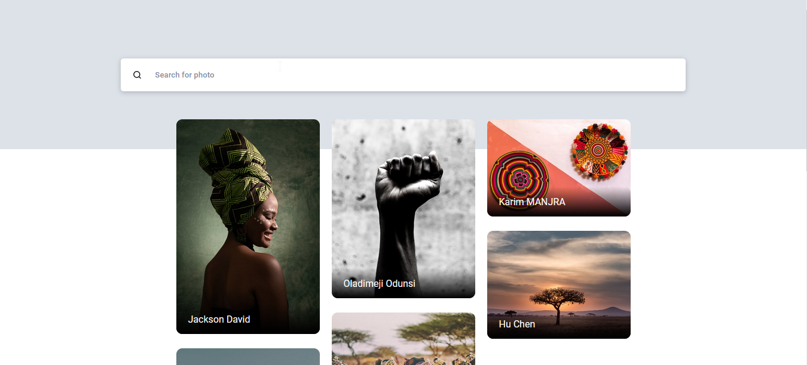

<h1 align="center">Photo Grid - Pixelz</h1>

   Solution for Frontend Test challenge from  <a href="https://cowrywise.com" target="_blank">Cowrywise</a>.

  <h3>
    <a href="https://cowrywise-test-pixelz.vercel.app/">
      Solution
    </a>
     | 
    <a href="https://www.notion.so/cowrywise/Frontend-Engineer-Test-3a4aeb677c604ca9b41cdac102d2f974">
      Test
    </a>
  </h3>

<!-- TABLE OF CONTENTS -->

## Table of Contents

- [Overview](#overview)
  - [Built With](#built-with)
- [Contact](#contact)

<!-- OVERVIEW -->

## Overview

### Built With

<!-- This section should list any major frameworks that you built your project using. Here are a few examples.-->

- HTML5
- CSS3 (modular css)
- [React](https://reactjs.org/)
- [Next.js](nextjs.org/)

## Acknowledgements

<!-- This section should list any articles or add-ons/plugins that helps you to complete the project. This is optional but it will help you in the future. For example: -->

- [Unsplash API](https://unsplash.com/developers)
- [JavaScript Array Methods](https://www.w3schools.com/js/js_array_methods.asp)
- [React Redux Quick Start](https://react-redux.js.org/tutorials/quick-start)
- [React](https://reactjs.org/)
- [Next.js](nextjs.org/)

## Contact

- GitHub [@Karl-Wilson](https://{github.com/Karl-Wilson})
- Instagram [@developerkarl](https://{instagram.com/developerkarl})
